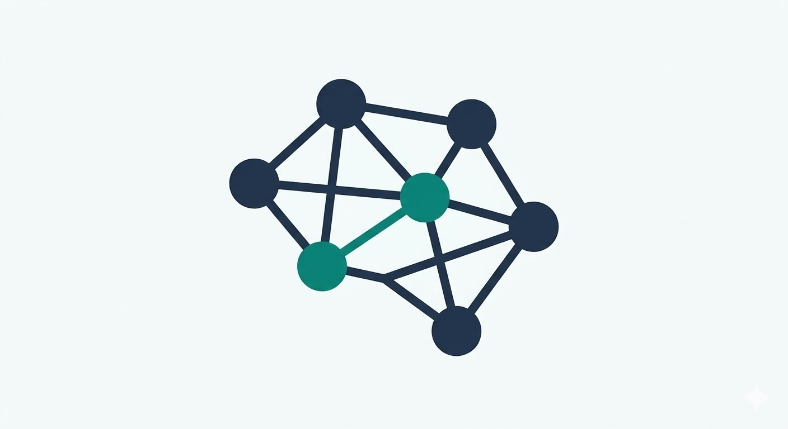

<p align="center">
  
</p>

<h1 align="center">MindMesh</h1>

<p align="center">
  <strong>Turn live conversations into visual diagrams — in real time.</strong>
</p>

MindMesh is a meeting copilot that listens to your conversation via browser speech-to-text and instantly generates structured diagrams (flowcharts, mind maps, timelines, org charts) on a shared whiteboard. Speak naturally; the whiteboard updates as you talk.

---

## Features

- **Real-time diagram generation** — nodes appear on the canvas while you're still speaking.
- **Multiple diagram types** — flowchart, mind map, timeline, and org chart, auto-detected from context.
- **Branching & nesting** — "there are two types of X: A and B" produces a proper tree, not a linear chain.
- **Incremental updates** — diagrams grow via lightweight patches; full replace only when the topic changes.
- **Multi-user sessions** — multiple browser tabs (or devices) share the same live session over WebSocket.
- **Corrections** — say "actually …" or "no, instead …" and the diagram adjusts.

---

## Tech Stack

| Layer | Technology |
|-------|-----------|
| Frontend | Next.js 16 · React 19 · React Flow (@xyflow/react) · Tailwind CSS 4 · Radix UI |
| Backend | Python · FastAPI · WebSocket · Pydantic |
| AI | OpenAI GPT-4o-mini (configurable) |
| Speech | Web Speech API (browser-native) |

---

## Getting Started

### Prerequisites

- **Python 3.12+**
- **Node.js 20+** and **pnpm**
- An **OpenAI API key**

### 1. Clone

```bash
git clone https://github.com/your-org/MindMesh.git
cd MindMesh
```

### 2. Backend

```bash
cd backend
python -m venv .venv && source .venv/bin/activate
pip install -r requirements.txt
```

Create `backend/.env`:

```env
MINDMESH_LLM_API_KEY=sk-...
MINDMESH_LLM_MODEL=gpt-4o-mini
MINDMESH_ALLOWED_ORIGINS=["http://localhost:3000"]
```

Start the server:

```bash
uvicorn app.main:app --reload
```

### 3. Frontend

```bash
cd Client
pnpm install
```

Create `Client/.env.local`:

```env
NEXT_PUBLIC_MINDMESH_WS_URL=ws://localhost:8000
```

Start the dev server:

```bash
pnpm dev
```

Open [http://localhost:3000](http://localhost:3000), join a session, and start talking.

---

## Project Structure

```
MindMesh/
├── backend/
│   ├── app/
│   │   ├── main.py                 # FastAPI app + lifespan
│   │   ├── config.py               # Settings (env vars)
│   │   ├── api/
│   │   │   ├── routes.py           # REST endpoints
│   │   │   ├── websocket.py        # WebSocket handler + pause watcher
│   │   │   └── signaling.py        # WebRTC signaling
│   │   ├── services/
│   │   │   ├── pipeline.py         # Main event pipeline
│   │   │   ├── model_orchestrator.py # LLM prompt + API call
│   │   │   ├── diagram_generator.py  # AI facts → diagram nodes/edges
│   │   │   ├── render_adapter.py     # Layout engine (tree positioning)
│   │   │   ├── trigger_engine.py     # When to call the LLM
│   │   │   ├── transcript_buffer.py  # Speech buffering + auto-commit
│   │   │   └── intent_classifier.py  # Rules-based intent detection
│   │   ├── schemas/                # Pydantic models (events, diagram, intent)
│   │   └── state/                  # In-memory session state
│   └── tests/
├── Client/
│   ├── app/                        # Next.js App Router pages
│   ├── components/                 # React components (canvas, meeting UI)
│   ├── hooks/                      # useSpeech, useWebSocket, useWebRTC
│   └── lib/mindmesh/              # Client state management
└── Makefile
```

---

## How It Works

1. **Speech** — The browser captures audio via the Web Speech API and streams partial/final transcript events over WebSocket.
2. **Trigger** — The backend detects when enough new text has accumulated (or silence is detected) and fires the pipeline.
3. **LLM** — The transcript chunk + current diagram are sent to GPT-4o-mini, which returns structured JSON (nodes, edges, diagram type).
4. **Layout** — The render adapter positions nodes in a tree layout and emits a `diagram.replace` or `diagram.patch` event.
5. **Canvas** — React Flow renders the nodes and edges with smooth animations.

---

## Running Tests

```bash
cd backend
python -m pytest tests/ -x -q --ignore=tests/test_websocket_broadcast.py
```

---

## License

MIT
